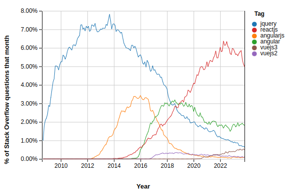
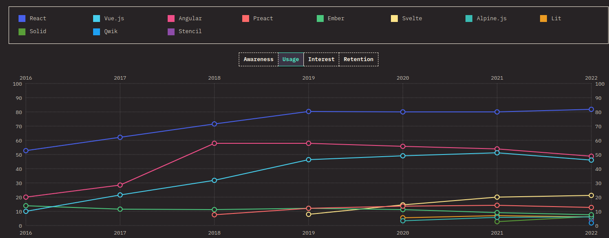
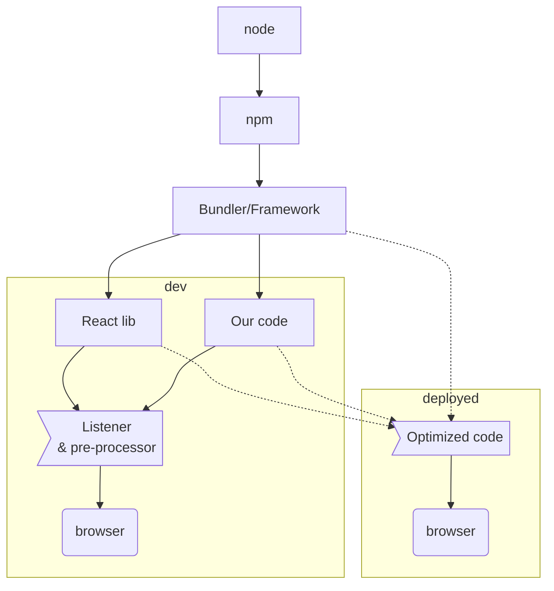
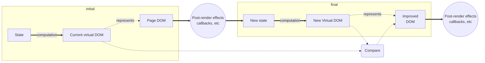

# React: Introducció

- Projecte: React fundamentals
- Autors: Genís Torrents
- Última edició: 2023-12-09
- Status: Draft

## React és popular:

A data d'avui React segueix essent de llarg el "setup" més rellevant en la construcció d'interfícies dinàmiques de frontend:

Vegeu, per exemple, les estadístiques de preguntes a StackOverflow (generades amb [aquest link](https://insights.stackoverflow.com/trends?tags=jquery%2Cangularjs%2Cangular%2Creactjs%2Cvuejs2%2Cvuejs3)):

Vegeu també el resultat de l'enquesta anterior de [state of JS](https://2022.stateofjs.com/en-US), pel que fa a ús de frameworks de frontend, 

Fins i tot si es confirma la tendència a la baixa (\*) que suggereixen les darreres estadístiques de Stackexchange, **React té corda per estona**.

(\*) -> Tinc motius per creure que el que aquest descens marca és una transició de React a Next i similars, però la conclusió requeriria una anàlisi més profunda.

## Per què React és popular:

Avantatges de React respecte els seus competidors originals:

- **No és un framework**, pots fer (força) el que vulguis
- **Estructura simple**, sensació (perillosa) de saber què estàs fent i tenir moltes maneres d'aconseguir el resultat volgut
- **Poques keywords**, poca "màgia", **control d'estat predictible**, amb curses de processos i inconsistències evitables si es programa bé
- **Nesting de components intuïtiu**, ja que reprodueix l'estructura d'html i, amb JSX, fins i tot la sintaxi d'html.
- **Algunes parts (JSX) semblen HTML** i mimetitzen l'estructura de la pàgina prou fidelment per poder saber ràpidament què és què sense entrenament específic
- **Tot és JS**, així que no cal conèixer molt bé com funciona per debugar i analitzar què passa
- **Comunitat enorme**, és fàcil trobar consells, respostes, llibreries dedicades, ...

Desavantatges de React contra els seus competidors originals:

- **Pesat**
- **Gelós**, vol parlar amb exclusivitat amb les parts de la pàgina que se li confien
- **Tolerant amb el codi dolent**, que pot malmetre molt fàcilment el rendiment i la mantenibilitat de la pàgina

Actualment, molts dels nous 'frameworks' de frontend s'inspiren en les aportacions de React, i, tot i resoldre sovint el problema de pes, sovint són molt més imprevisibles en el control d'estat i les curses de processos. Vegeu [un article recent](https://nolanlawson.com/2023/12/02/lets-learn-how-modern-javascript-frameworks-work-by-building-one/) sobre el tema. Cito:

<i>"React has dominated the frontend landscape for so long that every newer framework has grown up in its shadow. These frameworks were all heavily inspired by React, but they’ve evolved away from it in surprisingly similar ways. And although React itself has continued innovating, I find that the post-React frameworks are more similar to each other than to React nowadays. (...) same foundational ideas: 1) using reactivity (e.g. signals) for DOM updates, 2) using cloned templates for DOM rendering, 3) using modern web APIs like \<template> and Proxy"</i>

Per contra, l'advent de les **components web**, introduïdes progressivament entre 2017 i 2019 i avui en dia suportats parcialment per un 96,98% dels browsers en ús (i plenament per un 77.69% de browsers en ús) segons [canIuse](https://caniuse.com/?search=web%20components), ofereix una alternativa canònica i lleugera a l'estructura de components de React, que, si bé no gestiona estats, obre la porta a noves idees que puguin acabar desbancant-lo.

## Is it a library? Is it a framework?

**React** és una llibreria, però normalment quan diem que un projecte usa React volem dir que s'hi utilitza un setup molt més sofisticat. Esquemàticament,

El tipus de servei i de bundler/framework que convingui més al projecte dependrà de vàries qüestions (SSR vs SPA vs micro-React, principalment)

El fet que React vulgui exclusivitat a la part del DOM que controla ens força a acoblar-hi moltes altres llibreries, condicionant la forma de treballar a nivell global com ho faria un framework (però amb molta més llibertat arquitectònica)

## Què fa, doncs, la llibreria de React pel seu compte?

Cada procés iniciat per un canvi en l'estat de React i que conclou amb l'actualització del DOM s'anomena **render**. Un cop s'acaba aquest procés, React ens permet preparar uns callbacks que anomenem **efectes** post-render, pensats per no afectar el DOM, però sí, potencialment, l'estat, disparant nous processos de Render si és convenient.

Les fletxes sòlides del diagrama indiquen la informació que hem de programar per tal que React operi correctament. Es resumeixen en:

- Com generar el DOM virtual a partir de l'estat
- Quins callbacks s'inclouen al DOM (i com afecten a l'estat), efectes post-render inclosos.

A la secció següent veurem com configurar aquestes dues qüestions en la sintaxi de React.

Permeteu-nos fer èmfasi en un parell de punts delicats:

- React **només pot reaccionar als canvis d'estat de què té constància**. Si no actualitzem els estats de React amb els canvis i només actualitzem variables que React no reconeix com a tals, no hi haurà processos de Render fins (amb sort) que un altre agent canviï l'estat.
- React **necessita que el DOM tingui l'estructura que coneix** per implementar els canvis que ha determinat en la comparació de DOM virtuals. Si un altre agent afecta el DOM, el procés de render tindrà un error i React desmuntarà el DOM (almenys fins a l'error boundary més proper)
