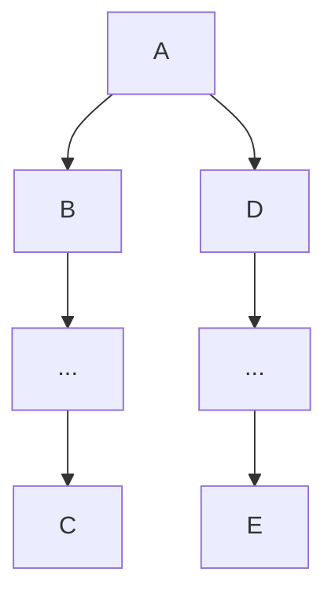
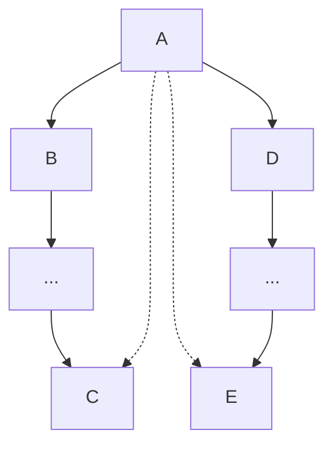
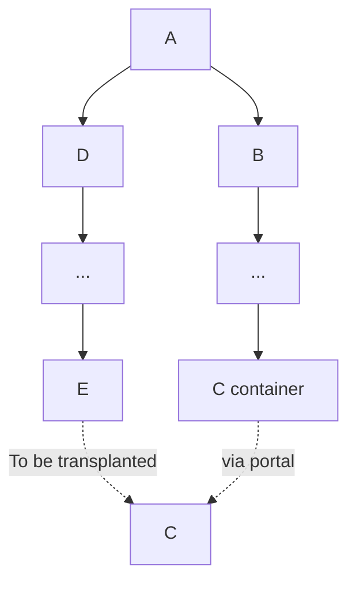

# React: Qüestions avançades

- Projecte: React fundamentals
- Autors: Genís Torrents
- Última edició: 2023-12-12
- Status: Draft

## Simplificant l'estructura de React

Considerem una situació amb la següent jerarquia al DOM:



Ara suposem que C i E treballen sobre unes dades comunes. Amb les normes que hem explicat fins ara, caldria que aquestes dades i les funcions que permeten gestionar-les fossin generades a A o un avantpassat i passéssin com a atributs a tots els descendents entre A i C i entre A i E.

Faríem alguna cosa així:

```JSX
const C = ({state, setState})=><div className="C">{state}</div>
const E = ({state, setState})=>(
  <input
    className="E"
    value={state}
    onChange={(e)=>setState(e.target.value)}
  />
)
const B = ({state, setState})=>{ //And D -> E in the same fashion
  return (
    <div className="B">
      ...
      <C state={state} setState={setState}/>
      ...
    </div>
  )
}
const A = ()=>{
  const [state, setState] = useState("")
  return (
    <div className="A">
      <B state={state} setState={setState}/>
      <D state={state} setState={setState}/>
    </div>
  )
}
```

El problema, aquí, és que estem acoblant, A, B i D (i possiblement altres coses que hi hagi entremig) amb estats que no tenen a veure amb elles. Si aquesta estructura es va repetint al llarg d'un projecte, al final tenim components molt complicades i la lògica es torna difícil de seguir i mantenir.

Per sort, React ens ofereix dues eines per simplificar aquesta estructura i desvincular A, B, D i altres descendents de lògica que no els afecta.

### Contexts

Permet accedir directament a dades d'un avantpassat declarat com a proveïdor del context utilitzant el hook 'useContext'. Al nostre exemple, per exemple, podríem usar

```JSX
const AContext = useContext()
const C = ()=>{
  const {value} = useContext(AContext)
  return <div className="C">{value}</div>
}
const E = ()=>{
  const {value, setValue} = useContext(AContext)
  return (
    <input
      className="E"
      value={state}
      onChange={(e)=>setState(e.target.value)}
    />
  )
}
const B = ()=><div className="B">...<C/>...</div> //D, E, ...
const A = ()=>{
  const [state, setState] = useState("")
  return (
    <AContext.Provider value={{state, setState}}>
      <div className="A">
        <B/>
        <C/>
      </div>
    </AContext.Provider>
  )
}
```

Noteu que ara, B, D i altres coses que hi hagi entremig, ja no necessiten saber res sobre l'estat que usen C i E. A encara l'utilitza, i el virtual DOM manté l'estructura del DOM, però amb dreceres a l'hora d'extreure propietats:



### Portals

Permeten que a l'hora d'associar el DOM virtual al DOM real "transplantem" parts lluny del lloc on els tocaria d'acord amb la seva lògica. Així, podem aconseguir el mateix DOM real però a partir del següent DOM virtual:



Per generar el portal usem la funció createPortal de 'react-dom' i l'incloem dins el JSX:

```JSX
const C = ({value})=><div className="C">{value}</div>
const E = ()=>{
  const [value, setValue] = useState("")
  const CContainer = document.getElementById('CContainer')
  return (
    <>
      <input
        className="E"
        value={state}
        onChange={(e)=>setState(e.target.value)}
      />
      {CContainer && createPortal(<C value={value}/>,CContainer)}
    </>
  )
}
const D = ()=><div className="D">...<E/>...</div>
const B = ()=><div className="D">...<div id="CContanier"/>...</div>
const A = ()=><div className="A"><B/><C/></div>
```

Noteu que ara sols E i C estan acoblades a l'estat, i la resta de l'estructura hi és agnòstica, com convindria.

### Usant JS pla sota l'estructura

Els renders de React no són pesats per la major part de propòsits, però fan notar el seu pes si volem processos molt freqüents. Quan comencem a jugar amb simulacions, requestAnimationFrame, etc, potser ens interessa un control directe amb JS dins l'encapsulament de React, i provocar renders només pels canvis majors.

TODO: Exercici sobre això.

## Gestió d'estat

Mirem més detalladament els hooks que ens permeten gestionar estat en una component:

### useReducer

Un reducer (com el famós Redux) gestiona una cua d'operacions sobre un estat centralitzat.

```JSX
  const reducer = (state, action)=>{
    if(action.type==='my_operation') return action.payload
    return state
  }
  const [state, dispatch] = useReducer(reducer, initialState)
  const handleReplaceState = (data)=>{
    dispatch({type:'my_operation', payload: data})
  }
```

En tractar-se d'una cua i utilitzar l'estat present com a part de la definició de cada operació, molts perills de la concurrència es redueixen, però cal ser molt conscient que l'estat en què s'emet una operació i l'estat amb què s'executa poden no ser el mateix.

Una dificultat del useReducer actual és que dispatch no retorna una promesa. La motivació per això és que el .then del canvi d'estat ja està definit i és un re-render, no seria correcte afegir efectes darrere que afectéssin el loop següent. Ara bé, recorda que sempre pots passar callbacks com a argument al dispatch i preparar-ho tot perquè el reducer els pugui invocar en executar la instrucció.

### useState

useState està construït sobre useReducer, però en simplifica una mica la sintaxi.

```JSX
  const [state, setState] = useState(initialState)

  setState(newState) //Per valor
  setState((presentState)=>{
    ...
    return newStateFromPresentState
  }) //Per callback
```

Noteu que hi ha 2 maneres d'utilitzar setState. Tot i que en el fons aquestes operacions funcionen amb una cua, el valor de l'estat enviat es clonarà utilitzant-lo per valor, però no per acció.

Quan utilitzar accions per callback? SEMPRE que puguem tenir concurrència. Convé tenir un sol state per les coses que canvien de forma coordinada per estalviar problemes.

Cal anar amb compte amb els synteticEvents de React, ja que React els reutilitza per estalviar memòria, i per tant en utilitzar setState per callback caldria extreure'n les dades importants que fem servir dins el callback.

NOTA: No he pogut arribar a més. Espero poder omplir les seccions següents aviat, i afegi més exercicis i contingut.

## Efectes avançats

useEffect, array de dependències i return
Annoying alerts

## Memorització

### useMemo

### useCallback

## Navegació i enrutat

SPA o next...

### useRouter

push VS replace, query params, ...
