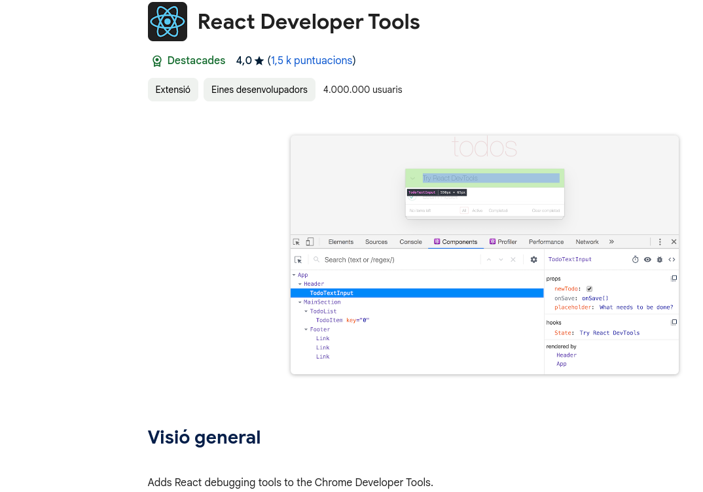
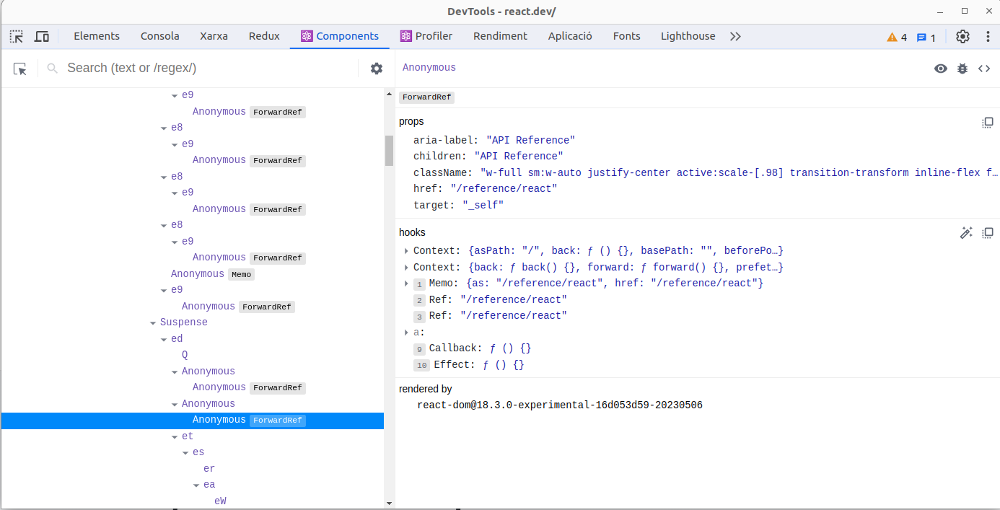
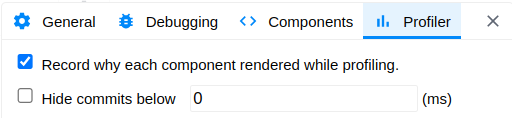
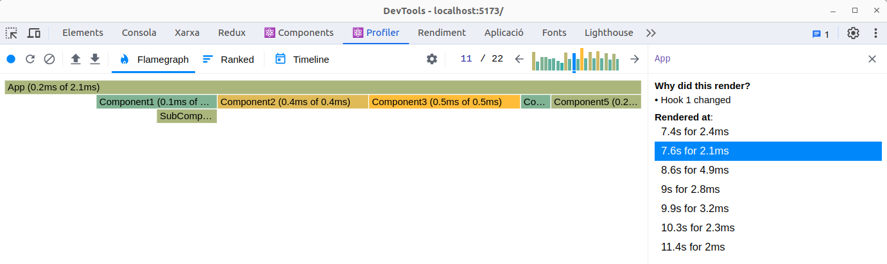

# React devtools

- Projecte: React fundamentals
- Autors: Genís Torrents Verdaguer
- Última edició: 2023-12-13
- Status: Draft

## Instal·lació

[La url des d'on es poden instal·lar](https://chromewebstore.google.com/detail/react-developer-tools/fmkadmapgofadopljbjfkapdkoienihi?pli=1) és el primer resultat de google per 'React devtools' a dia d'avui.

Un cop instal·lades veurem aparèixer dues pestanyes noves de devtools a les pàgines amb React anomenades Components i Profiler.

## Components

Components ens permet veure l'estructura del DOM Virtual de React. Hi veiem l'estructura en arbre de components actuals, amb el nom que els hem donat dintre el codi, i fent clic a qualsevol podem consultar-ne els valors d'atributs rebuts, els hooks (inclòs el seu estat quan en retornen), etc. Notareu que **els hooks apareixen numerats**. Quan fem debugging d'una component és important poder consultar aquest nombre, sobretot quan treballem amb profiler.

Evidentment, si mirem una pàgina després del build (i.e., un cop enlletgit el codi) els noms de les components són poc informatius. 

## Profiler

Aquest mecanisme no funciona a les versions de producció que no s'hagin configurat expressament per permetre-ho.

Abans d'utilitzar profiler, recomano configurar-lo adientment. A la configuració accessible des de qualsevol de les dues pàgines de devtools de React, busquem la pestanya "Profiler" i ens assegurem de marcar-hi "Record why each component rendered while profiling." 

Fet això: com funciona?

### Els botons

D'esquerra a dreta, tenim:

- Engegar/parar l'enregistrament
- Recarregar la pàgina iniciant l'enregistrament des del moment que es munta React
- Oblidar les dades actuals
- Carregar un profiling guardat o guardar el profiling actual
- Elecció de vista
  - Flamegraph mostra l'estructura de render component a component, indicant, per un render concret, els temps de renderització de cada una amb (t1 of t2), on t1 és el temps de renderitzar la pròpia component i el t2 el de renderitzar la component i tots els seus descendents. El color de cada barra representa t1.
    L'escala horitzontal representa els temps de render de cada block de forma fidel, i apila les components de forma que els descendents d'un node queden sota seu per ordre.
    En aquesta vista, quan seleccionem una component focalitzem la vista sobre el timespan de render d'aquesta component.
  - Ranked reestructura les components renderitzades al render seleccionat en una llista en què les més lentes en renderitzar es situen al capdamunt (segons t1).
  - Timeline ens permet identificar els processos de Render en una línia temporal. En sé dir molt poca cosa perquè el gràfic de columnes que apareix a les altres dues vistes em sembla més útil.

### El gràfic de columnes

Visible a les vistes de flamegraph i ranked, aquest diagrama a la dreta dels botons ens permet seleccionar un render (queda marcat en blau) per explorar-ne el procés. Al diagrama, l'alçada i el color representen el t2 total.

### Informació de render (a la dreta)

Damunt de tot hi posen el nom de la component seleccionada.
A continuació, responen la pregunta "Why did this render?" (aquí és on la numeració dels hooks que podem llegira components pot ser molt interessant).
Finalment, tenim la llista RenderedAt, que marca tots els renders del timeline on la component s'ha re-renderitzat (notació: t for t2), on t és el temps en el timeline comptant des del moment en què comença el profiling. Gràcies a això podem detectar:

- Llocs on podem guanyar eficiència reduïnt el nombre de renders o memoritzant
- Llocs on s'està generant una component nova enlloc de re-renderitzar l'existent per alguna negligència en la programació.

### Informació del cursor

- Quan tenim el cursor damunt d'una barra del diagrama de ranked o de flamegraph ens resumeix la informació de render però sense la llista del rendered at, sols la del render que estem visualitzant.
